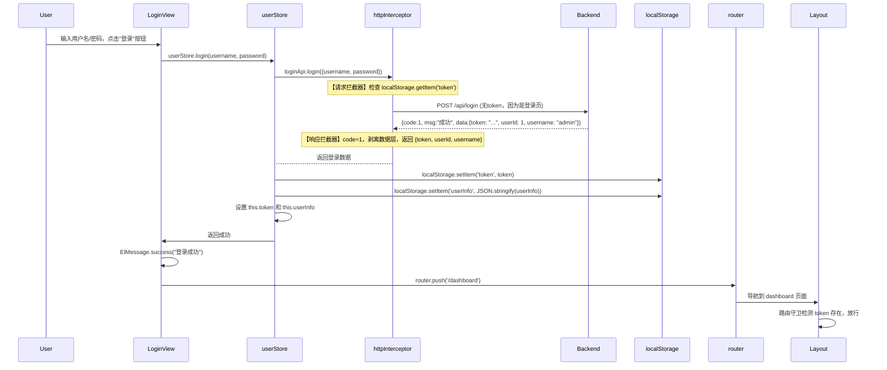
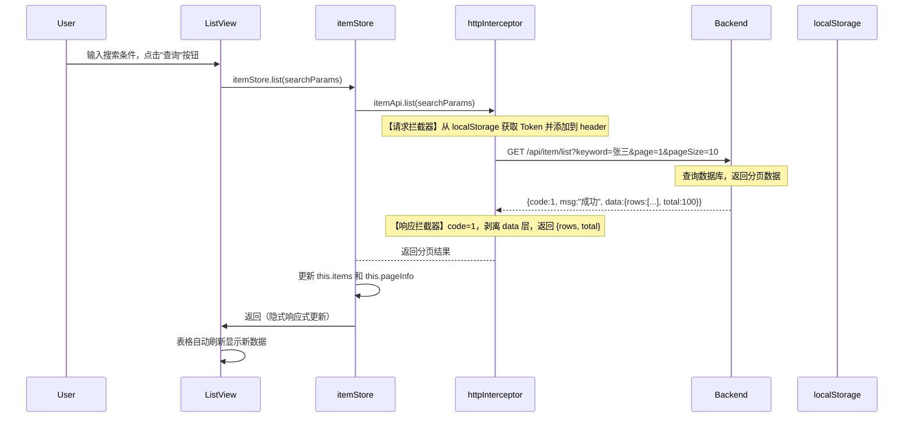

## 目录

- [1. 技术栈与工程概览](#1-技术栈与工程概览)
- [2. 项目目录结构](#2-项目目录结构)
- [3. 应用启动流程](#3-应用启动流程)
  - [3.1 index.html](#31-indexhtml)
  - [3.2 main.js 入口](#32-mainjs-入口)
  - [3.3 App.vue 根容器](#33-appvue-根容器)
- [4. 核心模块架构](#4-核心模块架构)
  - [4.1 路由系统](#41-路由系统)
  - [4.2 状态管理](#42-状态管理)
  - [4.3 API 封装](#43-api-封装)
  - [4.4 布局系统](#44-布局系统)
- [5. 从请求到响应全流程详解](#5-从请求到响应全流程详解)
  - [5.1 场景示例：登录](#51-场景示例登录)
  - [5.2 场景示例：查询列表分页数据](#52-场景示例查询列表分页数据)
- [6. 数据处理状态机](#6-数据处理状态机)
- [7. 错误处理机制](#7-错误处理机制)
- [8. 页面生命周期关联](#8-页面生命周期关联)
- [9. 架构设计原则](#9-架构设计原则)
- [小结](小结)

---

## 1. 技术栈与工程概览

本项目采用目前主流的中后台开发范式：

| 层级 | 技术 | 作用 |
|------|------|------|
| **构建工具** | Vite | 快速开发服务器 + Rollup 生产构建 |
| **框架** | Vue 3 | 响应式组件化框架 |
| **UI 库** | Element Plus | 企业级 UI 组件（按钮、表格、表单等） |
| **路由** | Vue Router 4 | 单页面应用路由管理 |
| **状态管理** | Pinia | 全局共享状态（替代 Vuex）|
| **HTTP 客户端** | Axios | 发起 HTTP 请求 |
| **组合式语法** | `<script setup>` | Composition API 语法糖 |

**核心理念**：**关注点分离 + 集中管理**。各层职责清晰，API 调用集中在 Store 中，避免业务组件污染。

---

## 2. 项目目录结构

```
src/
├── api/                    # 后端接口请求封装
│   ├── auth.js             # 登录/登出
│   ├── dept.js             # 分类管理
│   ├── item.js             # 主数据管理（通用示例）
│   ├── http.js             # Axios 实例（核心！含拦截器）
│   └── index.js            # 统一导出入口
├── router/                 # 路由配置
│   └── index.js            # 路由器实例
├── stores/                 # Pinia 状态管理
│   ├── user.js             # 用户状态管理
│   └── item.js             # 列表数据状态管理
├── views/                  # 页面级组件
│   ├── login/              # 登录页
│   │   └── Login.vue
│   ├── layout/             # 布局组件
│   │   ├── Layout.vue      # 侧边栏+顶部导航
│   │   └── Dashboard.vue   # 首页/仪表盘
│   ├── list1/              # 列表页面 1
│   ├── list2/              # 列表页面 2
│   ├── detail/             # 详情页面
│   └── settings/           # 设置页面
├── App.vue                 # 根容器（仅 <router-view>）
├── main.js                 # 应用入口
└── index.html              # HTML 模板
```

---

## 3. 应用启动流程

### 3.1 index.html

Vite 的 HTML 入口文件，定义了应用的挂载点：

```html
<!DOCTYPE html>
<html lang="en">
<head>
  <meta charset="UTF-8" />
  <title>Vue 应用</title>
</head>
<body>
  <div id="app"></div>  <!-- Vue 应用将挂载到这里 -->
  <script type="module" src="/src/main.js"></script>
</body>
</html>
```

### 3.2 main.js 入口

应用的核心启动文件，负责创建 Vue 实例、注册插件、挂载应用：

```javascript
// src/main.js
import { createApp } from 'vue'
import { createPinia } from 'pinia'
import ElementPlus from 'element-plus'
import 'element-plus/dist/index.css'
import * as ElementPlusIconsVue from '@element-plus/icons-vue'
import App from './App.vue'
import router from './router'

const app = createApp(App)

// 全局注册图标
for (const [key, component] of Object.entries(ElementPlusIconsVue)) {
  app.component(key, component)
}

// 注册插件
app.use(ElementPlus)
const pinia = createPinia()
app.use(pinia)
app.use(router)

// 挂载应用 —— 启动完成的关键一步！
app.mount('#app')
```

**执行顺序**：
1. `createApp(App)` —— 创建应用实例，根组件为 App.vue
2. `app.use(ElementPlus)` —— 注册 UI 组件库
3. `app.use(pinia)` —— 注册状态管理
4. `app.use(router)` —— 注册路由系统
5. `app.mount('#app)` —— 渲染到 DOM，应用启动

### 3.3 App.vue 根容器

`App.vue` 是应用的根容器，遵循**最小化原则**，只包含一个 `<router-view>`：

```vue
<!-- src/App.vue -->
<script setup>
# 根组件：无业务逻辑，仅承载路由出口
</script>

<template>
  <div id="app">
    <router-view />   # 匹配的路由组件将渲染在这里
  </div>
</template>

<style>
/* 全局样式 */
body { margin: 0; font-family: -apple-system, sans-serif; background: #f0f2f5; }
#app { min-height: 100vh; }
</style>
```

**设计原则**：单一职责、无业务逻辑、只做一件事——渲染路由出口。

---

## 4. 核心模块架构

### 4.1 路由系统 (`router/index.js`)

Vue Router 实现单页面应用（SPA）的路由管理：

```javascript
// src/router/index.js
import { createRouter, createWebHashHistory } from 'vue-router'

const routes = [
  // 独立路由（不使用 Layout 布局）
  { path: '/login', name: 'Login', component: () => import('../views/login/Login.vue') },

  // 嵌套路由（使用 Layout 布局）
  {
    path: '/',
    name: 'Layout',
    component: () => import('../views/layout/Layout.vue'),
    children: [
      { path: 'dashboard', name: 'Dashboard', component: () => import('../views/layout/Dashboard.vue'), meta: { title: '首页' } },
      { path: 'list1', name: 'List1', component: () => import('../views/list1/List1Page.vue'), meta: { title: '列表页面 1' } },
      { path: 'list2', name: 'List2', component: () => import('../views/list2/List2Page.vue'), meta: { title: '列表页面 2' } },
      { path: 'detail', name: 'Detail', component: () => import('../views/detail/DetailPage.vue'), meta: { title: '详情页面' } },
      { path: 'settings', name: 'Settings', component: () => import('../views/settings/SettingsPage.vue'), meta: { title: '设置页面' } },
      { path: 'logs', name: 'Logs', component: () => import('../views/logs/LogsPage.vue'), meta: { title: '日志页面' } },
      { path: '', redirect: '/dashboard' }  # 默认重定向
    ]
  }
]

const router = createRouter({
  history: createWebHashHistory(),  # Hash 模式
  routes
})

# ========== 路由守卫 ==========
router.beforeEach((to, from, next) => {
  const token = localStorage.getItem('token')
  if (to.path !== '/login' && !token) {
    next('/login')   # 未授权，跳登录页
  } else {
    next()           # 允许继续
  }
})

router.afterEach((to) => {
  document.title = to.meta.title || 'Vue 应用'  # 更新页面标题
})

export default router
```

**核心特性**：
- **懒加载**：`() => import()` 按需加载页面组件，减小首屏体积
- **嵌套路由**：Layout 作为父路由，子路由在 Layout 内部的 `<router-view>` 中渲染
- **路由守卫**：`beforeEach` 做权限校验，`afterEach` 更新标题
- **元信息**：`meta` 存储页面标题、权限标记等附加数据

### 4.2 状态管理 (`stores/user.js`)

Pinia 集中管理跨组件共享的状态：

```javascript
// src/stores/user.js
import { defineStore } from 'pinia'
import { ref } from 'vue'
import { loginApi } from '@/api/auth'
import { deptApi, itemApi } from '@/api/'

export const useUserStore = defineStore('user', {
  state: () => ({
    userInfo: null,     # 用户信息
    token: localStorage.getItem('token') || null,
    departments: [],    # 部门/分类列表（下拉选项示例）
    allItems: []        # 全部数据列表（选择器数据示例）
  }),

  actions: {
    async login(username, password) {
      const result = await loginApi.login({ username, password })
      this.token = result.token
      this.userInfo = { id: result.id, username: result.username, name: result.name }
      localStorage.setItem('token', this.token)
      localStorage.setItem('userInfo', JSON.stringify(this.userInfo))
      return this.userInfo
    },

    logout() {
      this.token = null
      this.userInfo = null
      localStorage.removeItem('token')
      localStorage.removeItem('userInfo')
    },

    async loadDepartments() {
      this.departments = await deptApi.list()
    },

    async loadAllItems() {
      this.allItems = await itemApi.listAll()  # 通用：加载所有条目数据
    }
  }
})

export const useItemStore = defineStore('item', {
  state: () => ({
    items: [],           # 当前页数据列表
    pageInfo: { total: 0, currentPage: 1, pageSize: 10, searchParams: {} }  # 分页信息
  }),

  actions: {
    async list(params = {}) {
      const result = await itemApi.list(params)
      this.items = result.rows
      this.pageInfo.total = result.total
      this.pageInfo.currentPage = params.page || 1
      this.pageInfo.pageSize = params.pageSize || 10
      this.pageInfo.searchParams = params
    },

    async add(data) {
      await itemApi.add(data)
      await this.list(this.pageInfo.searchParams)
    },

    async update(data) {
      await itemApi.update(data)
      await this.list(this.pageInfo.searchParams)
    },

    async delete(ids) {
      await itemApi.delete(ids)
      await this.list(this.pageInfo.searchParams)
    }
  }
})
```

**Store 协作**：不同 Store 可以相互调用，如 `user Store` 初始化时调用 `item Store` 加载条目数据。

### 4.3 API 接口封装 (`api/`)

前端对后端接口的分层封装，分为三层：Axios 实例 → 模块接口 → 统一导出

#### 第一层：Axios 实例与拦截器 (`src/api/http.js`)

```javascript
// src/api/http.js
import axios from 'axios'
import { ElMessage, ElMessageBox } from 'element-plus'

# 创建 Axios 实例
const api = axios.create({
  baseURL: '/api',      # 所有请求自动拼接此前缀
  timeout: 10000        # 超时 10 秒
})

# ========== 请求拦截器 ==========
api.interceptors.request.use(
  config => {
    const token = localStorage.getItem('token')
    if (token) {
      config.headers.token = token   # 自动注入 Token
    }
    return config
  },
  error => Promise.reject(error)
)

# ========== 响应拦截器 ==========
api.interceptors.response.use(
  response => {
    const data = response.data   # 后端返回：{code, msg, data}
    if (data.code === 1) {
      return data.data           # 剥离一层，直接返回业务数据
    } else {
      ElMessage.error(data.msg || '操作失败')
      return Promise.reject(new Error(data.msg || '操作失败'))
    }
  },
  error => {
    # 401 未认证自动处理
    if (error.response?.status === 401) {
      ElMessage.warning('请先登录')
      setTimeout(() => window.location.href = '/login', 1500)
      return Promise.reject()   # 阻止错误传播
    }
    ElMessage.error(error.message || '系统异常')
    return Promise.reject(error)
  }
)

export default api
```

**拦截器工作流程**：
```
请求 → [请求拦截器：加 Token] → HTTP 请求 → [响应拦截器：判 success/error] → 返回结果
```

#### 第二层：分模块 API (`src/api/auth.js`, `dept.js`, `item.js`...)

```javascript
// src/api/auth.js
import http from './http'

export const loginApi = {
  login: (data) => http.post('/login', data),      # POST /api/login
  logout: () => {
    localStorage.removeItem('token')
    localStorage.removeItem('userInfo')
    return http.get('/logout')                     # GET /api/logout
  }
}

// src/api/dept.js
import http from './http'

export const deptApi = {
  list: () => http.get('/department/list'),       # GET /api/department/list
  add: (data) => http.post('/department/add', data), # POST
  update: (data) => http.put('/department/update', data), # PUT
  delete: (ids) => http.delete('/department/delete', { params: { ids } }) # DELETE
}

// src/api/item.js
import http from './http'

export const itemApi = {
  list: (params) => http.get('/item/list', { params }),          # GET /api/item/list?pageSize=10&page=1
  getById: (id) => http.get(`/item/${id}`),                      # GET /api/item/1
  add: (data) => http.post('/item/add', data),                   # POST
  update: (data) => http.put('/item/update', data),              # PUT
  delete: (ids) => http.delete('/item/delete', { params: { ids } }) # DELETE
  listAll: () => http.get('/item/listAll')                       # GET /api/item/listAll（用于下拉选择器）
}
```

#### 第三层：统一导出 (`src/api/index.js`)

```javascript
// src/api/index.js
export { loginApi } from './auth'
export { deptApi } from './dept'
export { itemApi } from './item'
```

**使用方式**（推荐按模块导入）：
```javascript
import { loginApi } from '@/api/auth'
import { deptApi } from '@/api/dept'
import { itemApi } from '@/api/item'
```

### 4.4 布局系统 (`Layout.vue`)

Layout 是嵌套路由的核心，提供"固定布局 + 动态内容"的经典中后台结构：

```vue
<!-- src/views/layout/Layout.vue -->
<script setup>
import { ref, onMounted } from 'vue'
import { useRouter, useRoute } from 'vue-router'
import { useUserStore } from '@/stores/user'
import { useItemStore } from '@/stores/item'
import { ElMessageBox } from 'element-plus'

const userStore = useUserStore()
const itemStore = useItemStore()
const collapsed = ref(false)

onMounted(async () => {
  try {
    await userStore.loadDepartments()
    await userStore.loadAllItems()
    // itemStore.list()  # 如果需要，在 Layout 中也可以加载初始数据
  } catch (e) { console.warn(e) }
})

async function logout() {
  await ElMessageBox.confirm('确定退出？', '提示', { type: 'warning' })
  await userStore.logout()
  router.push('/login')
}
</script>

<template>
  <el-container class="app-container">
    <!-- 侧边栏 -->
    <el-aside :width="collapsed ? '64px' : '200px'" class="sidebar">
      <el-menu :default-active="route.path" :collapse="collapsed">
        <el-menu-item index="/dashboard">首页</el-menu-item>
        <el-menu-item index="/list1">列表页面 1</el-menu-item>
        <el-menu-item index="/list2">列表页面 2</el-menu-item>
        <el-menu-item index="/detail">详情页面</el-menu-item>
        <el-menu-item index="/settings">设置页面</el-menu-item>
      </el-menu>
    </el-aside>

    <!-- 主内容区 -->
    <el-container class="main-container">
      <el-header class="top-header">
        <span class="header-title">{{ getRouteName() }}</span>
        <span class="header-user">{{ userStore.userInfo?.name || '用户' }}</span>
        <el-button @click="logout">退出</el-button>
      </el-header>

      <el-scrollbar class="content-scroll">
        <router-view />  # 子路由页面渲染这里
      </el-scrollbar>
    </el-container>
  </el-container>
</template>
```

**嵌套路由渲染流程**：
```
访问 /list1
  ↓
路由匹配到父路由：path='/', component=Layout
  ↓
渲染 Layout 组件（侧边栏+顶部导航）
  ↓
Layout 内部 router-view 匹配子路由：path='list1', component=List1Page
  ↓
List1Page 渲染在 Layout 的内容区中
```

---

## 5. 从请求到响应全流程详解

这是本章的核心内容，详细说明从用户操作开始到最终收到后端响应的每一个环节。

### 5.1 场景一：用户登录

**场景描述**：用户在登录页面输入账号密码，点击登录按钮，系统向后端发起登录请求，成功后保存登录态并跳转到首页。



**步骤详解**：

| 步骤  | 位置/代码                   | 动作                                                                                     |
| --- | ----------------------- | -------------------------------------------------------------------------------------- |
| 1   | `views/login/Login.vue` | 用户在表单输入用户名/密码，点击登录按钮触发 `handleLogin()`                                                 |
| 2   | `Login.vue`             | 调用 `userStore.login(username, password)`                                               |
| 3   | `stores/user.js`        | `login()` action 中调用 `await loginApi.login({username, password})`                      |
| 4   | `api/auth.js`           | `loginApi.login()` 返回 `http.post('/login', data)`                                      |
| 5   | `api/http.js`           | **请求拦截器**拦截到请求，从 `localStorage` 取 token（登录时无 token，不添加），构造 config                      |
| 6   | 浏览器                     | 实际发出 HTTP POST 请求：`POST /api/login` (Vite 代理转发到后端)                                     |
| 7   | 后端 (Spring Boot)        | `/api/login` Controller 处理登录，验证凭证，返回 JSON `{code:1, msg:"成功", data:{token, userInfo}}` |
| 8   | 浏览器                     | HTTP 响应到达前端                                                                            |
| 9   | `api/http.js`           | **响应拦截器**处理响应：检查 `code === 1`，返回 `data.data` (直接返回业务对象，无需 `.data`)                     |
| 10  | `api/auth.js`           | `login()` 方法返回业务数据                                                                     |
| 11  | `stores/user.js`        | `login()` action 收到数据后：设置 `this.token`, `this.userInfo`, 持久化到 `localStorage`           |
| 12  | `Login.vue`             | `try...catch` 块捕获成功，显示成功消息，调用 `router.push('/dashboard')`                              |
| 13  | `router/index.js`       | 触发路由跳转，`beforeEach` 守卫检查 token 存在，放行                                                   |
| 14  | `Layout.vue`            | Layout 组件挂载，`onMounted` 重新加载部门/分类数据和商品选择器数据（因为 Store 已恢复）                              |

### 5.2 场景二：查询列表分页数据

**场景描述**：登录后进入列表页面，点击"查询"按钮，系统向后端发送分页请求，获取数据列表并展示在表格中。



**步骤详解**：

| 步骤 | 位置/代码 | 动作 |
|------|-----------|------|
| 1 | `views/list1/List1Page.vue` | 用户在搜索框输入条件，点击查询按钮触发表格重新加载 |
| 2 | `List1Page.vue` 中的 `queryItems()` 方法 | 调用 `await itemStore.list({page: 1, keyword: searchKeyword})` |
| 3 | `stores/item.js` | `list(params)` action 中调用 `await itemApi.list(params)` |
| 4 | `api/item.js` | `itemApi.list(params)` 返回 `http.get('/item/list', { params })` |
| 5 | `api/http.js` | **请求拦截器**：获取 `localStorage.token`，添加到 `config.headers.token`，发起请求 |
| 6 | 浏览器 | HTTP GET 请求：`GET /api/item/list?page=1&keyword=张三` (经 Vite 代理转发到后端) |
| 7 | 后端 (Spring Boot) | `/api/item/list` Controller 接收参数，调用 Service 查询数据库，执行分页查询 |
| 8 | 后端 | 组装响应：`R.success(rows, total)` → `{code:1, msg:"成功", data:{rows:[...], total:100}}` |
| 9 | 浏览器 | HTTP 200 响应到达 |
| 10 | `api/http.js` | **响应拦截器**：检查 `code === 1`，返回 `response.data` (即 `{rows, total}`); 若 code≠1 则报错弹出 |
| 11 | `api/item.js` | `list()` 方法返回业务数据 |
| 12 | Stores | `list()` action 更新 `this.items = result.rows` 和 `this.pageInfo.total = result.total` |
| 13 | Vue 响应式系统 | `items` 数组变化，所有使用该数据的组件（如 `List1Page.vue` 中的表格）自动重新渲染 |
| 14 | `List1Page.vue` | `<el-table :data="itemStore.items">` 自动刷新，显示新的数据列表 |

**关键细节**：
- **响应式更新**：Pinia 的 state 是基于 `ref/reactive` 的响应式对象，修改后自动触发依赖组件的重新渲染，无需手动调用 `setState` 或 `forceUpdate`
- **Token 自动注入**：从第二步开始，所有请求都会自动带上之前登录时存储的 token，无需开发者手动设置
- **数据剥离**：通过响应拦截器，前端直接使用 `{rows, total}` 而不需要写 `result.data.data`，代码更简洁
- **错误统一处理**：如果后端返回 `code: -1`，拦截器会统一弹出 `ElMessage.error` 提示，页面 catch 块不需要重复处理

---

## 6. 数据处理状态机

理解数据流转的关键是把握整个流程中的**状态变化**：

```
初始状态: Store.state = { items: [], pageInfo: { total: 0 } }
                                      ↓
用户触发请求 (点击查询按钮)
                                      ↓
Loading 状态: Store.setLoading(true) (可选，可显示全局 loading)
                                      ↓
发起 HTTP 请求 (axios)
                                      ↓
[分支 A] 成功路径:
    请求拦截器: 加 Token
    HTTP GET /api/item/list
    后端处理，返回 {code:1, data:{rows:[...], total:100}}
    响应拦截器: 剥离 data 层，返回 {rows, total}
    Store 更新: this.items = rows; this.pageInfo.total = total
    Loading: false
    组件自动重渲染

[分支 B] 失败路径:
    网络错误 / 后端返回 code≠1
    响应拦截器: ElMessage.error("错误信息"), reject 错误
    Store 不更新 state
    组件保持原状
```

**状态流转图**：
```
idle (空闲) --[用户操作]--> loading (加载中)
                             ├──[成功]--> idle (数据已更新)
                             └──[失败]--> idle (显示错误提示)
```

---

## 7. 错误处理机制

前端错误处理是分层的，形成**三层防御体系**：

### 第一层：请求拦截器 (网络层错误)

当请求无法发出时（如断网、DNS 解析失败），请求拦截器的第二个参数（error handler）会被触发：

```javascript
api.interceptors.request.use(
  config => { /* ... */ },
  error => {
    console.error('请求拦截器错误:', error)
    return Promise.reject(error)
  }
)
```

### 第二层：响应拦截器 (HTTP 业务层错误)

响应拦截器分为两个回调函数：

1. **success 回调**：处理正常的 HTTP 响应（2xx 状态码）
2. **error 回调**：处理非 2xx 响应或网络错误

```javascript
api.interceptors.response.use(
  response => {
    # 业务层错误判断（响应体中的 code 字段）
    if (response.data.code === 1) {
      return response.data.data
    } else {
      ElMessage.error(response.data.msg || '操作失败')
      return Promise.reject(new Error(response.data.msg || '操作失败'))
    }
  },
  error => {
    # HTTP 状态码错误（如 404, 500, 网络断开）
    if (error.response?.status === 401) {
      ElMessage.warning('请先登录')
      setTimeout(() => window.location.href = '/login', 1500)
      return Promise.reject()
    }
    ElMessage.error(error.message || '系统异常')
    return Promise.reject(error)
  }
)
```

### 第三层：业务层 catch (可选)

虽然拦截器已经处理了大部分错误，但业务代码仍可选择添加 catch 做特殊处理：

```javascript
async function loadItems() {
  try {
    await itemStore.list(params)
  } catch (error) {
    # 这里可以做更细致的错误处理
    console.error('加载数据列表失败:', error)
    # 或者显示不同的提示
  }
}
```

**错误分类表**：

| 错误类型 | 触发位置 | 处理方式 |
|----------|----------|----------|
| 网络错误 | 请求拦截器 error | 打印日志，Promise.reject |
| 401 未认证 | 响应拦截器 error | 弹出警告，1.5s 后跳转登录页 |
| 业务错误 (code≠1) | 响应拦截器 success | 弹出错误消息，抛出异常 |
| 500 服务器错误 | 响应拦截器 error | 提示"系统异常" |
| 超时错误 | 响应拦截器 error | 提示"请求超时" |

---

## 8. 页面生命周期关联

请求过程与 Vue 组件的生命周期密切相关，特别是在数据加载时机上：

```
应用启动 (main.js mount)
  ↓
Layout 组件挂载 (onMounted)
  ├── userStore.loadDepartments()  # 初始化下拉选项数据
  └── userStore.loadAllItems()     # 初始化选择器数据
  ↓
用户导航至 List1Page 页面 (路由切换)
  ↓
List1Page 组件挂载 (onMounted)
  ├── 读取 store.state.items (可能已缓存)
  └── 或直接调用 itemStore.list() 重新查询
  ↓
用户点击"查询"按钮
  ↓
触发 queryItems() method
  ├── itemStore.list(params)   # 再次发起请求
  ├── request interceptor (加 token)
  ├── HTTP request
  ├── response interceptor (处理 success/error)
  ├── Store 更新 state
  └── 组件自动重新渲染 (响应式更新)
```

**关键点**：
- `onMounted` 是发起首次数据请求的最佳时机（组件已挂载，可安全操作 DOM 或发起请求）
- Store 的状态在整个应用生命周期中保持（除非用户登出），多个页面共享同一份数据
- 第二次查询时，如果数据已经在 Store 中，可以选择不再重复请求（视业务需求而定）

---

## 9. 架构设计原则

回顾整个 Vue 前端架构，可以总结出以下核心设计原则：

### 9.1 关注点分离 (Separation of Concerns)

| 职责 | 负责模块 |
|------|----------|
| **应用入口** | `main.js` |
| **根容器** | `App.vue` |
| **路由导航** | `router/index.js` |
| **页面布局** | `Layout.vue` |
| **具体业务页面** | `views/list1/*.vue`、`views/detail/*.vue` 等 |
| **全局状态** | `stores/` |
| **API 请求** | `api/` |
| **UI 组件** | `Element Plus` |

每个模块只关注自己的职责，不越界。例如：页面组件不直接调用 API，而是通过 Store；Store 不处理 UI 逻辑，只管理数据和业务方法。

### 9.2 集中管理

- **API 请求集中**：所有 HTTP 请求都经过 `api/http.js` 的拦截器，自动加 token、统一错误处理
- **状态集中**：用户信息、部门列表、数据列表等共享状态都存在 Pinia Store 中，任何组件都可以订阅变化
- **路由集中**：所有页面路径和组件映射都在 `router/index.js` 中定义

### 9.3 约定优于配置

- 后端返回格式约定：`{code, msg, data}`，前端通过这一约定自动区分成功/失败
- API 命名约定：`模块名 + Api` (如 `itemApi`, `deptApi`)，统一从 `api/` 导入
- Store 命名约定：`useXXXStore`，函数形式调用而非 `new`

### 9.4 最小化根组件

`App.vue` 只做两件事：提供挂载点和路由出口。不包含任何业务逻辑，确保"单一职责"。

### 9.5 懒加载优化

所有页面组件使用动态导入 `() => import()`，Vite 自动将每个页面拆分成独立代码块，首屏只加载必要资源。

### 9.6 响应式驱动

通过 Vue 的响应式系统（`ref`、`reactive`）和 Pinia 的 Store 状态绑定，数据变化自动触发界面更新，无需手动操作 DOM。

---

## 小结

本总结系统梳理了 Vue3 前端工程的整体架构设计和完整的请求响应流程：

### 架构全景
```
index.html → main.js (创建应用) → App.vue (根容器)
                      ├── router/index.js (路由系统 + 守卫)
                      ├── stores/ (Pinia 状态管理)
        ├── api/ (Axios 封装 + 拦截器)
        └── views/ (页面组件 + Layout 布局)
```

### 请求-响应核心链路
```
用户操作 → 组件调用 Store.action → Store.callApi() 
    → [请求拦截器: 加 Token] → HTTP 请求 → 后端处理
    → [响应拦截器: 判 success/error] → 剥离数据层 → Store 更新 state
    → 响应式更新 → 组件自动重渲染
```

这套架构是目前 Vue3 生态的主流标准方案，具有以下优势：
- ✅ **可维护性高**：各层职责清晰，修改一处影响范围可控
- ✅ **代码复用性强**：拦截器、Store、API 封装减少重复代码
- ✅ **用户体验好**：懒加载、自动登录态保持、统一的错误提示
- ✅ **易于扩展**：新增页面只需添加 Store、API、路由配置三处代码

掌握这套架构设计原理和前端的请求响应全流程，能够帮助开发者快速理解和构建大型 Vue3 应用，也能在面对前端问题时快速定位到问题所在。

关联知识点：
- [[学习/JavaWeb/知识条目/前端/Vue3应用入口]] main.js 创建流程
- [[App.vue根组件]] 根容器设计
- [[Layout.vue页面布局]] 布局组件设计
- [[script setup语法]] 组件语法
- [[Pinia状态管理]] 状态管理
- [[Vue Router路由配置]] 路由系统
- [[Vue Router路由守卫]] 权限守卫
- [[API接口封装]] API 封装与拦截器原理